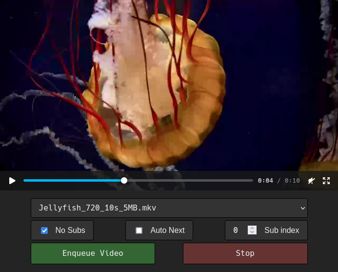

# HomeMedia

Live transcoding home media WebDAV server.

Provides for live encoding vp9+opus webm encoded video for mobile playback when accessed via the main index site. All other WebDAV operations as normal.



Requires `ffmpeg` to be installed and on your PATH or provided by `-ffmpeg <path>`.

## Usage

```bash
homemedia -data /data/
```
